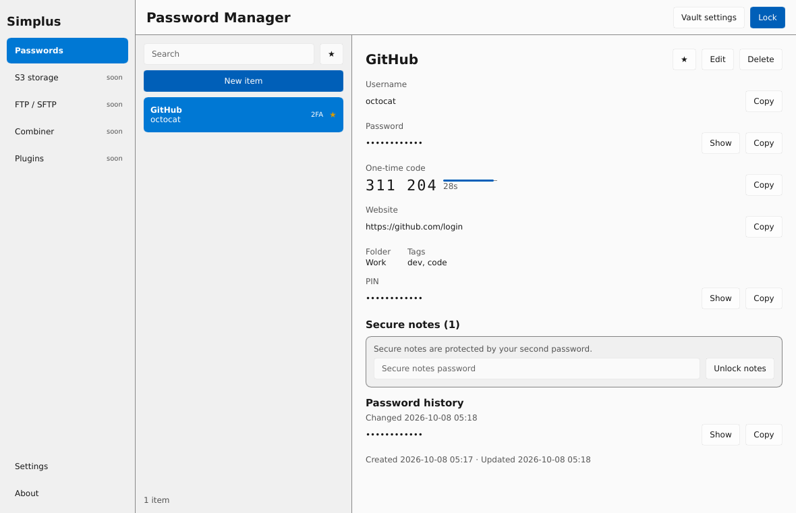

# Simplus

A cross-platform (Windows-first) desktop toolbox written in Rust with a Slint UI, extensible through community plugins.

Official modules (in build order):

- **Password manager**: Argon2id + XChaCha20-Poly1305 vault, a second password for secure notes, TOTP, recovery kit, optional self-hostable zero-knowledge sync
- **S3 manager**: any S3-compatible provider, one-way sync local↔S3 and S3→S3, schedules
- **FTP/FTPS/SFTP manager**: site manager protected by a master password, diff-based sync, schedules
- **Folder → Markdown combiner**: local folders or GitHub repos into one LLM-friendly Markdown file

Status: early development; see [docs/ROADMAP.md](docs/ROADMAP.md) and [docs/ARCHITECTURE.md](docs/ARCHITECTURE.md).

## Building

Requires Rust 1.92+.

```sh
cargo test --workspace
cargo run -p simplus-app
```

On Linux, building needs `libxkbcommon-dev` and `libfontconfig-dev`, and running needs `libxkbcommon-x11-0`.

Data lives in `%LOCALAPPDATA%\Simplus` on Windows (`~/.local/share/simplus` on Linux). Put an empty file named `simplus.portable` next to the executable to keep everything in a `data` folder beside it instead.

## Password manager



- **Two passwords**: the master password unlocks the vault and shows record passwords. A second, different password unlocks **secure notes** (several per record).
- **Recovery key**: shown once when the vault is created. It resets both passwords; *Vault settings* can generate a new one.
- **Records**: username, password (with history), websites, folder, tags, favourite, custom fields (optionally hidden), and **TOTP** codes from an `otpauth://` link or a secret key.
- **Generator**: random passwords or EFF-wordlist passphrases, with a zxcvbn strength meter.
- **Safety**: auto-lock after inactivity and when Windows locks. Copied secrets are kept out of Win+V history and cleared after 30 s.
- **Import / export**: Bitwarden (JSON/CSV), Chrome/Edge, Firefox, KeePassXC and generic CSV; encrypted `.simplusvault` backups; plain CSV export behind a warning.
- **Crypto**: Argon2id (64 MiB, 3 passes, 4 lanes) wraps random 256-bit keys, and every item is sealed separately with XChaCha20-Poly1305. See [docs/ARCHITECTURE.md](docs/ARCHITECTURE.md).
